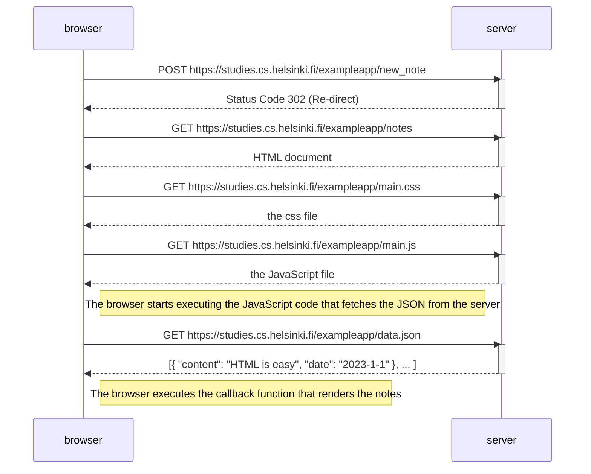
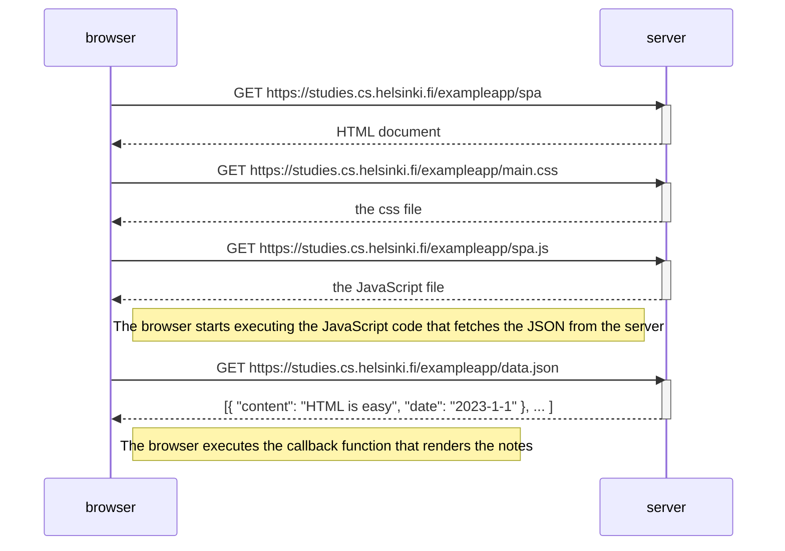
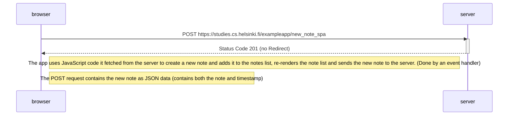

# Sean Jin - Submission for Part 0

## 0.4: When a user submits/saves a note

## 0.5: When a user goes to the SPA version of the notes app

## 0.6 When a user creates a new note using the SPA version of the notes app

